 

## About

Backend engineer focused on building **production-grade systems**: containerized APIs, document-intelligence tools, and data-driven platforms. I own projects end-to-end — architecture, implementation, and deployment.

- Currently open to **remote backend / full-stack roles**, Spanish-speaking markets first
- Latest build: **CV_ANALYTICS**, an AI-powered CV analysis engine
- Daily environment: Arch Linux, containers, and a terminal

## Stack

**Backend**

    

**Data & AI**

    

**Frontend & DevOps**

     

## Selected Work

**CV_ANALYTICS** — AI-powered CV analysis engine that scores profiles against real job descriptions. `FastAPI · LangChain · Vue 3 · PostgreSQL`

**Kognis** — Business intelligence platform with microservice architecture and AI-assisted analysis. `NestJS · Prisma · Nuxt 3`

**bran.ai** — Multi-tenant support assistant with per-company context and streaming responses. `NestJS · FastAPI · ChromaDB`

**caza-ofertas** — Price-monitoring service for Mexican retailers, running in production with Telegram alerts. `Python · Playwright`

Full case studies at [cmorales.dev](https://cmorales.dev).

## Contact

*Open to remote backend / full-stack roles.*

 

